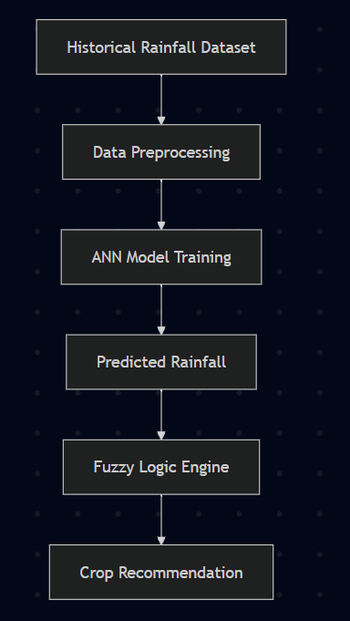
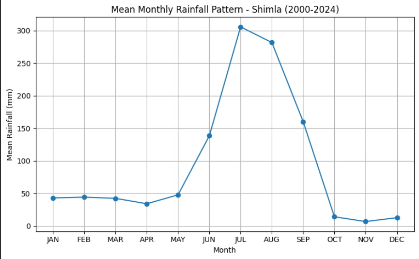
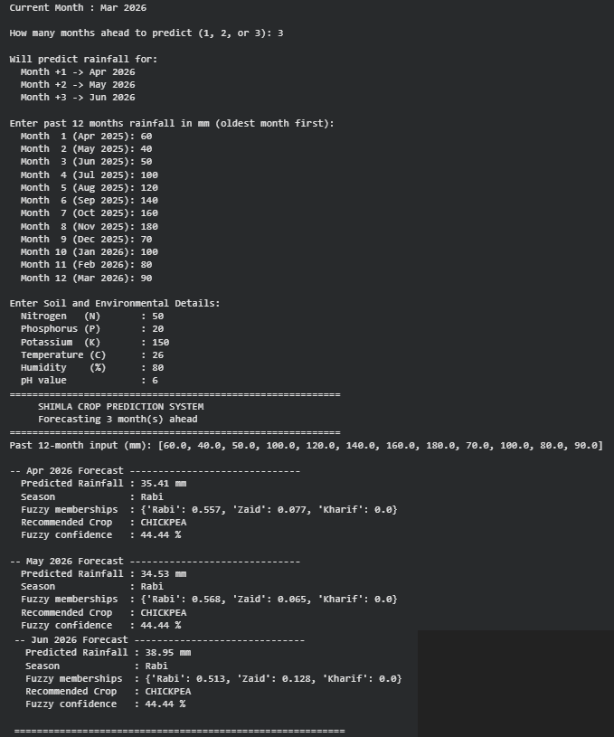

# Location-Based Crop Recommendation Using Artificial Neural Networks and Fuzzy Logic

## Overview

This project presents an intelligent crop recommendation system that combines Artificial Neural Networks (ANN) and Fuzzy Logic to assist in agricultural decision-making.

The ANN model is trained to predict rainfall based on historical rainfall data, while the fuzzy inference system classifies rainfall patterns and recommends suitable crops for cultivation. The objective is to support farmers and researchers by providing data-driven crop recommendations.

---

## Key Features

- Rainfall prediction using Artificial Neural Networks (ANN)
- Crop recommendation using Fuzzy Logic
- Historical rainfall data preprocessing
- Model training and evaluation
- Interactive prediction system
- Performance evaluation using standard regression metrics

---

## Project Structure

```
Crop-Recommendation/
│
├── data/
│   ├── Crop_recommendation.csv
│   ├── shimla_rainfall.csv
│
├── notebook/
│   └── Location_Based_Crop_Recommendation.ipynb
│
├── images/
│
├── requirements.txt
└── README.md
```

---

## Technology Stack

- Python
- TensorFlow / Keras
- Scikit-learn
- Pandas
- NumPy
- Matplotlib

---

## Methodology

The project follows the workflow below:

1. Load historical rainfall and crop datasets.
2. Perform data preprocessing and normalization.
3. Train an Artificial Neural Network for rainfall prediction.
4. Evaluate model performance using regression metrics.
5. Apply Fuzzy Logic rules for season classification.
6. Recommend the most suitable crop based on predicted rainfall.

---
## Methodology

The project follows the workflow below:

1. Load historical rainfall and crop datasets.
2. Perform data preprocessing and normalization.
3. Train an Artificial Neural Network for rainfall prediction.
4. Evaluate model performance.
5. Apply Fuzzy Logic rules.
6. Recommend the most suitable crop.

---

## Workflow

<p align="center">
  
</p>

---

## Performance Evaluation

- Mean Absolute Error (MAE)
- Mean Squared Error (MSE)
- Root Mean Squared Error (RMSE)
## Performance Evaluation

The ANN model is evaluated using:

- Mean Absolute Error (MAE)
- Mean Squared Error (MSE)
- Root Mean Squared Error (RMSE)

---

## Installation

Clone the repository

```bash
git clone https://github.com/gautam-v3/Crop-Recommendation.git
```

Install dependencies

```bash
pip install -r requirements.txt
```

Launch the notebook

```
notebook/Location_Based_Crop_Recommendation.ipynb
```

Run all cells sequentially.

---

## Datasets

This project utilizes:

- Historical Shimla Rainfall Dataset
- Crop Recommendation Dataset

Both datasets are available in the `data` directory.

---
## Rainfall Trend Analysis

The figure below shows the average monthly rainfall pattern for Shimla (2000–2024). This analysis provides the historical rainfall trends used to train the Artificial Neural Network (ANN).

<p align="center">
  
</p>


## Future Improvements

- Integration of real-time weather APIs
- Support for multiple geographical locations
- Web-based deployment using Flask or FastAPI
- Mobile application for farmers
- Enhanced recommendation using additional soil and climate parameters

---
## Prediction Output

<p align="center">
  
</p>

## Author

**Gautam V**

Integrated M.Tech in Software Engineering

Vellore Institute of Technology (VIT), Vellore
